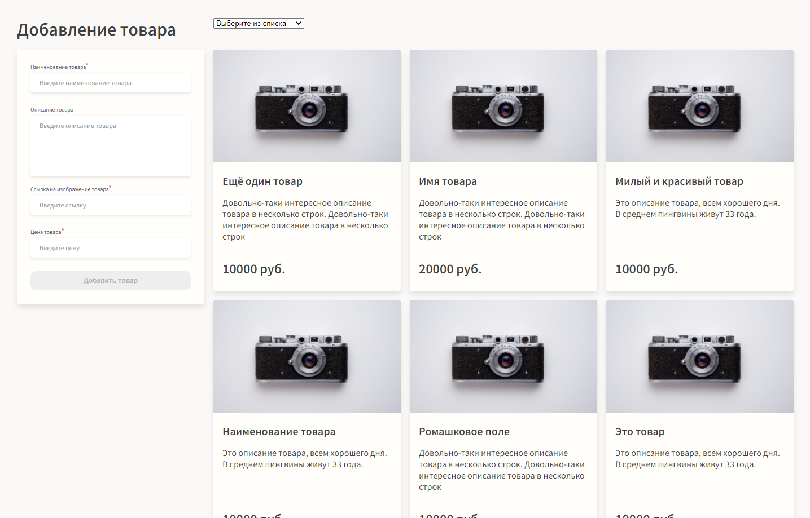

# Каталог товаров

> Это приложение, которое я написала в качестве тестового задания. В нём можно добавлять, удалять и сортировать товары. Форма добавления валидирована и, пока все условия не будут соблюдены, кнопка "Добавить товар" не будет активна.

  

## Built With

- HTML, SASS
- Nuxt, Vuex
- VeeValidate

## Live Demo

- [Здесь вы можете посмотреть на "живую" версию приложения!](https://idyllic-taffy-87754c.netlify.app/)

## Getting Started

Чтобы скопировать проект на свой компьютер, нужны предустановленные:

- IDE (например, VSCode)
- Node.js

## Чтобы запустить проект на своём компьютере:

1. Нажмите на зелёную кнопку "Code" и выберите предпочитаемый способ клонирования проекта.
2. Склонируйте проект на свой компьютер
3. Откройте папку с проектом в предпочитаемом редакторе (желательно VSCode).
4. Нажмите "View" и выберите "Terminal" в меню.
5. Введите `npm i` в открывшемся терминале, чтобы установить все зависимости.
6. Введите `npm start` в терминале, чтобы запустить проект на своём локальном сервере.

## Author

- GitHub: [@rdnrn](https://github.com/rdnrn)
- LinkedIn: [Nana Rodina](https://www.linkedin.com/in/arina-rodina-144612219/?locale=en_US)
- Twitter: [nana](https://twitter.com/rdnrn_nana)
